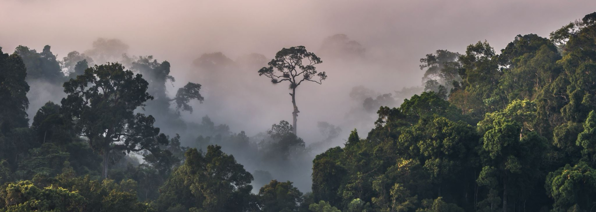

# Monitoring Palm Oil-Driven Deforestation in Borneo Through K-means Analysis of Satellite Data



## Table of Contents
- [Overview](#overview)
- [Methodology](#methodology)
- [Installation](#installation)
- [Usage](#usage)
- [Results](#results)
- [References](#references)

## Background 
This project is a submission for the module Artificial Intelligence for Earth Observation, which forms part of my education on the AI for Sustainable Development MSc at University College London.

Deforestation is a major contributing factor to the current ecological crisis facing the planet. Some areas have suffered its effects more acutely than others - the tropics lost a record-shattering 6.7 million hectares of primary rainforest in 2024, an area almost the size of Panama [1]. Borneo was chosen for this study, as its a region located in the tropics home to a diverse ecosystems and animals such as the orangutan, pygmy elephant and clouded leopard. It has only half of its forest cover remaining today, down from 75% in the 1980s [2]. A primary driver for deforestation in this region is the expansion of palm oil plantations for agriculture, industrial palm plantations grew by 128,000 hectares in 2023, a 59% increase from the previous year, the associated deforestation increased by 53% [3]. This study aims to highlight an issue facing tropical ecosystems across the world, an issue where economic productivity is prioritised over the preservation of rich biodiversity.

## Overview
Remote sensing enables the acquisition of information about a region of interest from a distance through satellite imagery analysis. It allows for cost and time-efficient studies of deforestation at scale, with satellite imagery being freely accessible to the public. This study utilises images from the Sentinel-2 satellite, accessed via the Copernicus browser through Google Earth Engine (GEE). GEE provides flexibility in adjusting the size of the region of interest and accessing data directly without manual downloading.

Sentinel-2 was selected for its optimal spectral bands for vegetation analysis, particularly the NIR (Near Infrared) and red bands essential for NDVI calculation. These bands enable computation of the vegetation indices that serve as inputs to the machine learning algorithm. 

Two regions representing both Malaysia and Indonesia are analysed in this study. The first location is Sabah, Malaysia, chosen for its rapid palm oil plantation expansion and coastal forest conversion patterns. The Kinabatangan River, which flows through the study region, is home to endangered species including orangutans and proboscis monkeys. The second region is West Kalimantan, Indonesia, selected for its inland deforestation hotspots where traditional threshold-based methods often struggle to distinguish between degraded forest, secondary growth, and plantation agriculture. This cross-border analysis enables better understanding of deforestation patterns across Borneo.

Due to the absence of ground truth labels, an unsupervised learning approach was employed. The K-means algorithm clusters pixels by similarity based on vegetation indices. To ensure temporal consistency, the algorithm is trained on 2020 imagery and applied to both 2020 and 2024 datasets. Pixel count changes are then analysed to quantify deforestation rates in each study area. Cloud masking techniques were implemented to remove irrelevant pixels.

Please find the analysis carried out in the file Borneo_deforestation_monitoring_kmeans.ipynb which is stored on this repository.


## Dataset

The datasets used in this study are Sentinel-2 images, which are accessed using Google Earth Engine (GEE) to extract images from the Copernicus browser.

The code within the notebook automatically selects images from each time period with the least cloud coverage possible, but also allows manual override to select images by index. This was necessary to override the 2024 image for West Kalimantan as the default image had unfavourable cloud conditions.

### Sentinel-2 Satellite Images of Sabah, Malaysia
- **Location**: Kinabatangan River region
- **Coordinates**: 5.5° N, 118.0° E
- **Characteristics**: Rapid palm oil expansion, coastal forest conversion
- **Image 1 (Baseline)**: 2020-11-06 
- **Image 2 (Recent)**: 2024-09-11

### Sentinel-2 Satellite Images of West Kalimantan, Indonesia  
- **Location**: Inland deforestation hotspots
- **Coordinates**: 0.5° N, 109.75° E
- **Characteristics**: Complex forest degradation patterns, challenging for traditional methods
- **Image 1 (Baseline)**: 2020-11-06 
- **Image 2 (Recent)**: 2024-09-11


## Methodology

### Vegetation Indices
Four vegetation indices are calculated from Sentinel-2 spectral bands to characterise land cover types:

NDVI (Normalised Difference Vegetation Index): Primary indicator of vegetation health and density
EVI (Enhanced Vegetation Index): Optimised for dense tropical forest canopy detection
SAVI (Soil Adjusted Vegetation Index): Reduces soil background interference in vegetation signals
NDMI (Normalised Difference Moisture Index): Captures vegetation moisture content and stress levels

These indices leverage the distinct spectral signatures of different land cover types, enabling discrimination between primary forest, degraded forest, plantations, and cleared land. Using a combination of indices provides a more robust foundation for our analysis, allowing for a clearer identification of what land cover type a pixel is more so than any one index alone [4].

### K-means Clustering Application
The K-means algorithm performs unsupervised classification by clustering pixels with similar vegetation characteristics which are quantified using the above indices. The methodology employs temporal consistency by training the model exclusively on 2020 data sampling 2000 pixels to do so. Then applying the same cluster definitions to both 2020 and 2024 imagery. This approach ensures meaningful change detection by maintaining consistent land cover classifications across time periods.
Optimal cluster number is determined through silhouette analysis, typically resulting in 5-7 clusters representing different land cover types from water/shadow through primary forest. Pixel count changes between time periods quantify deforestation rates and land cover transitions, enabling assessment of forest loss and plantation expansion patterns across the study regions.


## Limitations and Future Work
Cloud coverage was more prevalent in the West Kalimantan images, further studies could include widening the size of the study areas to minimise the affect of cloud coverage reducing the number of pixels available for training. 

## Installation

To replicate this analysis a Google Earth Engine account is required. 

### Required Packages
```bash
pip install earthengine-api
pip install geemap
pip install pandas numpy matplotlib seaborn scikit-learn
```

## Environmental cost of research project

### Direct Research Costs
Satellite Data Processing & Extraction: The environmental cost of accessing pre-processed Sentinel-2 L2A data through the Copernicus platform is minimal, as the computational burden falls on ESA's existing infrastructure. Data transfer costs are estimated at approximately 0.01 kg CO₂ for the volumes required [5].

The entire notebook can be executed in under ten minutes. Studies examining energy consumption in cloud environments report values in kWh for similar workloads, with corresponding carbon emissions measured in gCO2e How to estimate carbon footprint when training deep learning models? A guide and review - PMC. For a 10-minute runtime with basic computational tasks, emissions are estimated between 0.02-0.05 kg CO₂ [6].

K-means Analysis Pipeline: The unsupervised clustering approach employed requires significantly less computational resources than deep learning alternatives. K-means algorithms typically consume approximately 0.1 kWh for datasets of this scale, resulting in roughly 0.04 kg CO₂ emissions [7].

LLM Assistance for Research: Development support involved approximately 50 queries to language models for coding assistance. Recent analyses suggest that ChatGPT queries now use 0.3 Wh. This translates to approximately 0.15-0.22 kg CO₂ for the research support provided [8].

### Infrastructure Costs 

Sentinel-2 Satellite Launch & Maintenance: Launch operations typically generate 2,000-5,000 tonnes CO₂ per satellite deployment Operating sustainably &ndash; Google Data Centers. However, when distributed across the millions of global users accessing Sentinel-2 data over the mission's 7+ year operational period, individual study contributions become negligible (~0.001-0.002 kg CO₂) [9].

LLM Training Infrastructure: Training GPT-3 consumed 552 tonnes of CO2, although this cost has been distributed over billions of prompts, we still required a trained model for this research [10].

### Total Study Emissions:

- **4,552-10,552 tonnes CO₂** - To conduct this analysis independently, accounting for the full environmental cost of launching Sentinel-2 satellites and training the LLM required for the project's completion.  
- **0.22-0.32 kg CO₂** - When considering satellite launch and LLM training as shared infrastructure costs not directly attributable to this individual study. This reflects the marginal cost when infrastructure is already available and can support multiple research projects accessing the same data and computational resources.

### Comparative Analysis and Benefits

The study enables remote monitoring of over 31,000 hectares of tropical forest, eliminating the need for field surveys that would require international flights, ground transportation, and accommodation - collectively generating orders of magnitude more emissions.The methodology's scalability allows global forest monitoring without proportional emission increases, supporting conservation decisions that could prevent substantially larger environmental impacts from continued deforestation.


## References 
[1] - https://gfr.wri.org/latest-analysis-deforestation-trends  
[2] - https://www.unep.org/news-and-stories/story/deforestation-borneo-slowing-regulation-remains-key  
[3] - https://nusantara-atlas.org/2023-marks-a-surge-in-palm-oil-expansion-in-indonesia/  
[4] - Xue, J., & Su, B. (2017). Significant remote sensing vegetation indices: A review of developments and applications. Journal of Sensors, 2017, 1353691.  
[5] - Sobrino, J. A., Franch, B., Mattar, C., Jiménez‐Muñoz, J. C., & Corbari, C. (2012). A method to estimate global carbon dioxide uptake by forests from satellite data.  
[6] - Masanet, E., Shehabi, A., Lei, N., Smith, S., & Koomey, J. (2020). Recalibrating global data center energy-use estimates. Science, 367(6481), 984-986.  
[7] - Lloyd, S. (1982). Least squares quantization in PCM. IEEE transactions on information theory, 28(2), 129-137.  
[8] - Luccioni, A. S., Viguier, S., & Ligozat, A. L. (2022). Estimating the carbon footprint of BLOOM, a 176B parameter language model. arXiv preprint arXiv:2211.02001.  
[9] - Ross, M. N., Toohey, D. W., Peinemann, M., & Ross, P. M. (2010). Limits on the space launch market related to stratospheric ozone depletion. Astropolitics, 8(1), 50-82.  
[10] - Strubell, E., Ganesh, A., & McCallum, A. (2019). Energy and policy considerations for deep learning in NLP. Proceedings of the 57th Annual Meeting of the Association for Computational Linguistics, 3645-3650.  

