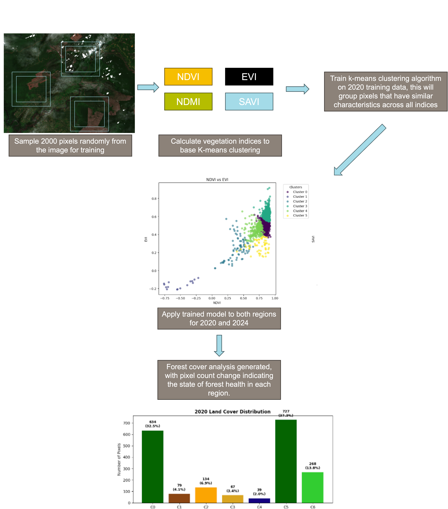

# Using K-means unsupervised learning to track forest cover loss in Borneo.

## Table of Contents
- [Overview](#overview)
- [Methodology](#methodology)
- [Installation](#installation)
- [Usage](#usage)
- [Results](#results)
- [References](#references)

## Background 
According to the Food and Agriculture Organization (FAO), an estimated 10 million hectares (24.7 million acres) of forests are lost annually, contributing to approximately 12-20% of global greenhouse gas emissions. [1] 

## Overview
Remote sensing is-
Copernicus browser + GEE, opted for GEE directly through the notebook 

Brief description of the problem and your approach

## Methodology



Detailed explanation of your approach...

## Installation
```bash
# Clone the repository
git clone https://github.com/your-username/your-repo.git

# Install dependencies
pip install -r requirements.txt


## References 
[1] - 
